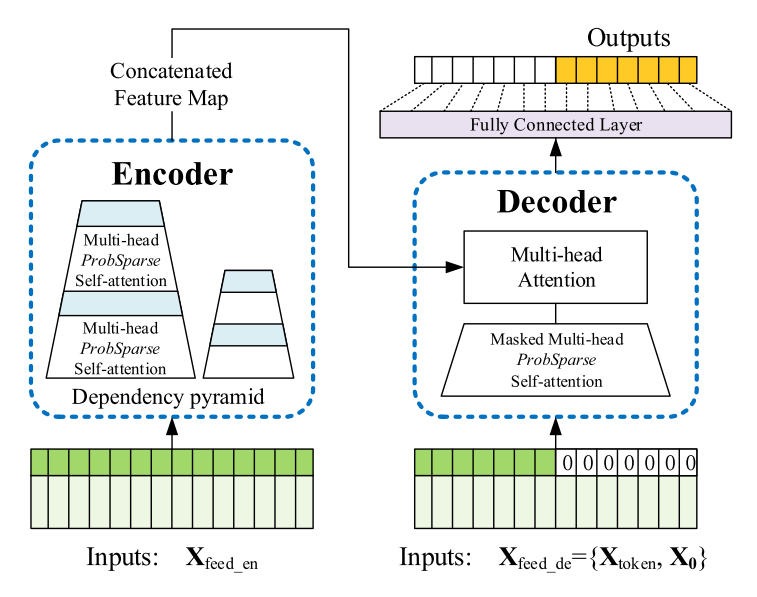

# Informer: Beyond Efficient Transformer for Long Sequence Time-Series Forecasting (AAAI'21 Best Paper)

本仓库是论文 [Informer: Beyond Efficient Transformer for Long Sequence Time-Series Forecasting](https://arxiv.org/abs/2012.07436) 的MindSpore代码实现


<p align="center">

<br><br>
<b>图 1.</b> Informer 模型架构.
</p>


## Requirements

- Python 3.6
- mindspore==2.0.0
- numpy==1.21.6
- pandas==1.3.5
- ruamel.base==1.0.0

依赖库可以通过以下命令进行安装
```bash
pip install -r requirements.txt
```

## Configs

配置文件位于 `configs` 文件夹下，支持GPU和Ascend两种环境下的模型训练和测试，各参数的含义见下方表格


| Parameter name | Description of parameter |
| --- | --- |
| model | The model of experiment. This can be set to `informer`, `informerstack`, `informerlight(TBD)` |
| data           | The dataset name                                             |
| root_path      | The root path of the data file (defaults to `./data/ETT/`)    |
| data_path      | The data file name (defaults to `ETTh1.csv`)                  |
| features       | The forecasting task (defaults to `M`). This can be set to `M`,`S`,`MS` (M : multivariate predict multivariate, S : univariate predict univariate, MS : multivariate predict univariate) |
| target         | Target feature in S or MS task (defaults to `OT`)             |
| freq           | Freq for time features encoding (defaults to `h`). This can be set to `s`,`t`,`h`,`d`,`b`,`w`,`m` (s:secondly, t:minutely, h:hourly, d:daily, b:business days, w:weekly, m:monthly).You can also use more detailed freq like 15min or 3h |
| checkpoints    | Location of model checkpoints (defaults to `./checkpoints/`)  |
| seq_len | Input sequence length of Informer encoder (defaults to 96) |
| label_len | Start token length of Informer decoder (defaults to 48) |
| pred_len | Prediction sequence length (defaults to 24) |
| enc_in | Encoder input size (defaults to 7) |
| dec_in | Decoder input size (defaults to 7) |
| c_out | Output size (defaults to 7) |
| d_model | Dimension of model (defaults to 512) |
| n_heads | Num of heads (defaults to 8) |
| e_layers | Num of encoder layers (defaults to 2) |
| d_layers | Num of decoder layers (defaults to 1) |
| s_layers | Num of stack encoder layers (defaults to `3,2,1`) |
| d_ff | Dimension of fcn (defaults to 2048) |
| factor | Probsparse attn factor (defaults to 5) |
| padding | Padding type(defaults to 0). |
| distil | Whether to use distilling in encoder, using this argument means not using distilling (defaults to `True`) |
| dropout | The probability of dropout (defaults to 0.05) |
| attn | Attention used in encoder (defaults to `prob`). This can be set to `prob` (informer), `full` (transformer) |
| embed | Time features encoding (defaults to `timeF`). This can be set to `timeF`, `fixed`, `learned` |
| activation | Activation function (defaults to `gelu`) |
| output_attention | Whether to output attention in encoder, using this argument means outputing attention (defaults to `False`) |
| do_predict | Whether to predict unseen future data, using this argument means making predictions (defaults to `False`) |
| mix | Whether to use mix attention in generative decoder, using this argument means not using mix attention (defaults to `True`) |
| cols | Certain cols from the data files as the input features |
| num_workers | The num_works of Data loader (defaults to 0) |
| itr | Experiments times (defaults to 2) |
| train_epochs | Train epochs (defaults to 6) |
| batch_size | The batch size of training input data (defaults to 32) |
| patience | Early stopping patience (defaults to 3) |
| learning_rate | Optimizer learning rate (defaults to 0.0001) |
| des | Experiment description (defaults to `test`) |
| loss | Loss function (defaults to `mse`) |
| lradj | Ways to adjust the learning rate (defaults to `type1`) |
| use_amp | Whether to use automatic mixed precision training, using this argument means using amp (defaults to `False`) |
| inverse | Whether to inverse output data, using this argument means inversing output data (defaults to `False`) |
| use_gpu | Whether to use gpu (defaults to `True`) |
| gpu | The gpu no, used for training and inference (defaults to 0) |
| use_multi_gpu | Whether to use multiple gpus, using this argument means using mulitple gpus (defaults to `False`) |
| devices | Device ids of multile gpus (defaults to `0,1,2,3`) |

## Train

训练脚本位于 `run.py` 文件中，可以通过以下命令进行训练：

```bash
python run.py --config_name configs/informer_GPU.yaml
```

分布式训练命令如下

```bash
mpirun -n 2 python run.py --config_name configs/informer_GPU.yaml --distribute
```

训练和测试由informer.yaml中的do_train参数控制，True为训练，False为测试

## Result

informer模型在ETTh1数据集中进行一个epoch的训练和测试结果如下

```
DEVICE: GPU
Args in experiment:
tuple(model='informer', data='ETTh1', root_path='./data/ETT/', data_path='ETTh1.csv', features='S', target='OT', freq='h', detail_freq='h', checkpoints='./checkpoints/', seq_len=96, label_len=48, pred_len=48, enc_in=1, dec_in=1, c_out=1, d_model=512, n_heads=8, e_layers=2, d_layers=1, s_layers=[3, 2, 1], d_ff=2048, factor=5, padding=0, distil=True, dropout=0.05, attn='prob', embed='timeF', activation='gelu', output_attention=False, do_predict=False, mix=True, cols='+', num_workers=0, itr=1, train_epochs=1, batch_size=32, patience=3, learning_rate=0.0001, des='Informer_ms', loss='mse', lradj='type1', use_amp=False, inverse=False, seed=42, device='GPU', do_train=True, ckpt_path='./Informer_test.ckpt', distribute=False, device_num=None, rank_id=None)
Setting: informer_ETTh1_ftS_sl96_ll48_pl48_dm512_nh8_el2_dl1_df2048_atprob_fc5_ebtimeF_dtTrue_mxTrue_Informer_ms_0
>>>>>>>start training : informer_ETTh1_ftS_sl96_ll48_pl48_dm512_nh8_el2_dl1_df2048_atprob_fc5_ebtimeF_dtTrue_mxTrue_Informer_ms_0>>>>>>>>>>>>>>>>>>>>>>>>>>
train 8497
val 2833
test 2833
        iters: 50, epoch: 1 | loss: 0.1499475
        speed: 0.5953s/iter; left time: 128.5760s
        iters: 100, epoch: 1 | loss: 0.2183122
        speed: 0.4017s/iter; left time: 66.6849s
        iters: 150, epoch: 1 | loss: 0.2224802
        speed: 0.4053s/iter; left time: 47.0197s
        iters: 200, epoch: 1 | loss: 0.2576445
        speed: 0.4024s/iter; left time: 26.5595s
        iters: 250, epoch: 1 | loss: 0.1233429
        speed: 0.3989s/iter; left time: 6.3819s
Epoch: 1 cost time: 116.18329453468323
Epoch: 1, Steps: 265 | Train Loss: 0.1898140 Vali Loss: 0.0934528 Test Loss: 0.0836777
Validation loss decreased (inf --> 0.093453).  Saving model ...
>>>>>>>testing : informer_ETTh1_ftS_sl96_ll48_pl48_dm512_nh8_el2_dl1_df2048_atprob_fc5_ebtimeF_dtTrue_mxTrue_Informer_ms_0<<<<<<<<<<<<<<<<<<<<<<<<<<<<<<<<<
test 2833
test shape: (88, 32, 48, 1) (88, 32, 48, 1)
test shape: (2816, 48, 1) (2816, 48, 1)
mse:0.0834205225110054, mae:0.2264273762702942, rmse:0.2888261079788208
```

## <span id="citelink">Citation</span>
If you find this repository useful in your research, please consider citing the following papers:

```
@article{haoyietal-informerEx-2023,
  author    = {Haoyi Zhou and
               Jianxin Li and
               Shanghang Zhang and
               Shuai Zhang and
               Mengyi Yan and
               Hui Xiong},
  title     = {Expanding the prediction capacity in long sequence time-series forecasting},
  journal   = {Artificial Intelligence},
  volume    = {318},
  pages     = {103886},
  issn      = {0004-3702},
  year      = {2023},
}
```
```
@inproceedings{haoyietal-informer-2021,
  author    = {Haoyi Zhou and
               Shanghang Zhang and
               Jieqi Peng and
               Shuai Zhang and
               Jianxin Li and
               Hui Xiong and
               Wancai Zhang},
  title     = {Informer: Beyond Efficient Transformer for Long Sequence Time-Series Forecasting},
  booktitle = {The Thirty-Fifth {AAAI} Conference on Artificial Intelligence, {AAAI} 2021, Virtual Conference},
  volume    = {35},
  number    = {12},
  pages     = {11106--11115},
  publisher = {{AAAI} Press},
  year      = {2021},
}
```

